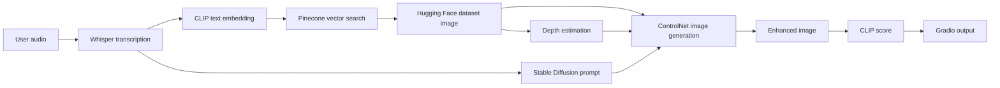
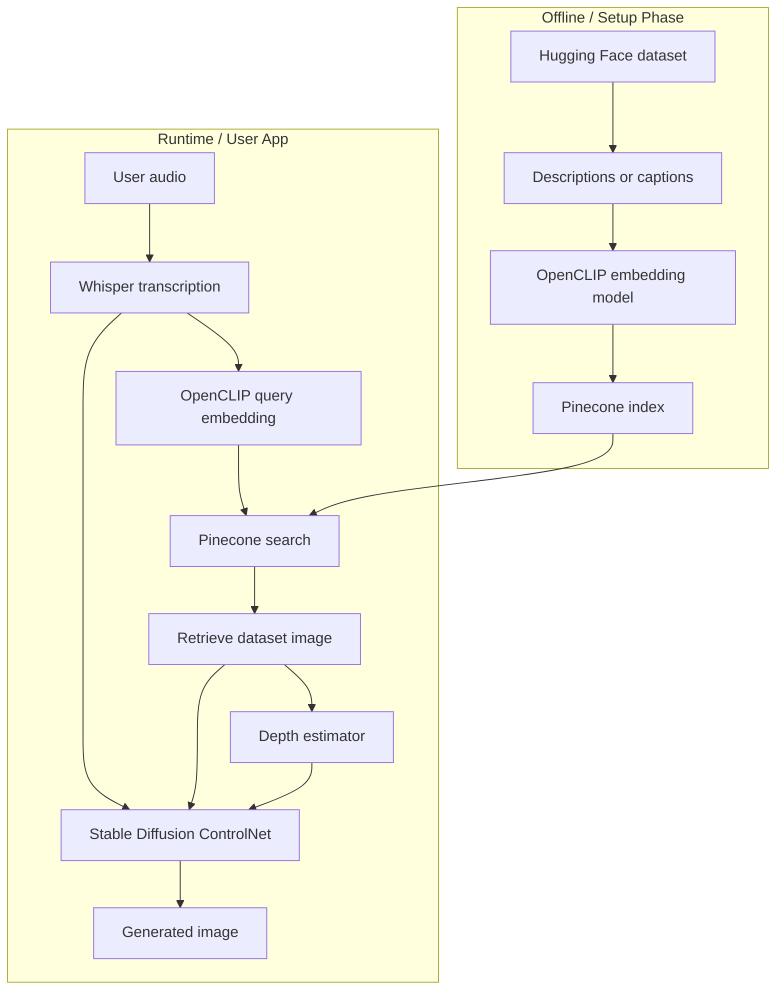

# Beginner Guide: Audio-to-Image Generation Project

This guide explains the project from the ground up. It is written for a beginner who wants to understand the idea, the code, the setup, and how to redesign it for Google Colab or Kaggle when a local GPU is not powerful enough.

## 1. Project Goal In One Sentence

The project takes a spoken prompt from a user, finds a related educational image from a vector database, then uses Stable Diffusion ControlNet to enhance that image based on the spoken prompt.

Example:

```text
User speaks: "Explain line of best fit in linear regression"

App:
1. Converts speech to text.
2. Searches a Pinecone vector database for a matching image.
3. Loads that image from a Hugging Face dataset.
4. Creates a depth map from the image.
5. Uses Stable Diffusion + ControlNet to generate an improved image.
6. Shows the retrieved image, enhanced image, description, and score.
```

## 2. The Big Picture

This app combines five different AI/data systems:



## 3. What Each Tool Does

### Gradio

Gradio creates the web interface. It gives the user:

- a microphone/audio input
- sliders for generation settings
- dropdowns for Pinecone index and dataset choice
- image outputs
- text outputs

In this project, Gradio is only the front end. It does not do AI by itself.

### Whisper

Whisper is used for speech-to-text.

The user gives audio. Whisper returns text.

```text
Audio waveform -> "support vector machines"
```

The code uses:

```python
pipeline("automatic-speech-recognition", model="openai/whisper-base.en")
```

### CLIP / OpenCLIP

CLIP is used to connect text and images in the same embedding space.

In simple words, an embedding is a list of numbers that represents meaning.

Example:

```text
"line of best fit" -> [0.12, -0.08, 0.44, ...]
```

The app uses OpenCLIP to convert the transcribed prompt into a 512-dimensional vector. That vector is sent to Pinecone to find the closest stored image.

### Pinecone

Pinecone is the vector database.

It stores vectors and metadata. In this project, Pinecone should already contain entries like this:

```json
{
  "id": "image-001",
  "values": [0.12, -0.08, 0.44],
  "metadata": {
    "image_path": "linear_regression/best_fit.png",
    "description": "A diagram explaining line of best fit."
  }
}
```

When the user asks for "line of best fit", Pinecone returns the image metadata with the closest vector.

Important: the current app only queries Pinecone. It does not build or upload the Pinecone index.

### Hugging Face Datasets

The actual images are loaded from a Hugging Face dataset.

The Pinecone result gives an `image_path`. The app then loops through the Hugging Face dataset and finds the dataset item whose `image_path` matches.

The dataset is expected to have at least:

```text
image
image_path
```

Optionally:

```text
description
```

### Depth Estimation

ControlNet needs a control signal. In this project, the control signal is a depth map.

A depth map is a grayscale-like image that estimates which parts of the image are near or far.

The depth estimator takes the retrieved image and produces this map.

```text
Retrieved image -> Depth map -> ControlNet
```

### Stable Diffusion

Stable Diffusion generates the final enhanced image.

In this project, it is not generating from pure text only. It uses:

- the transcribed prompt
- the retrieved image
- the depth map
- ControlNet
- optionally a LoRA adapter

### ControlNet

ControlNet helps Stable Diffusion follow the structure of the original image.

Without ControlNet, Stable Diffusion may ignore the layout of the retrieved image. With ControlNet depth, it tries to preserve the structure while changing the style/content according to the prompt.

### LoRA

LoRA is a small fine-tuned adapter added on top of the Stable Diffusion model.

In this project:

```python
LORA_WEIGHTS_PATH = "rohith2812/atoi-lora-finetuned-v1"
```

That means the app is using someone else's LoRA from Hugging Face.

You can:

- keep it if you have permission and it works
- replace it with your own LoRA
- disable it while testing

To disable LoRA, set this in `.env`:

```env
LORA_WEIGHTS_PATH=
```

### CLIP Score

After generation, the app calculates a CLIP similarity score between:

- the generated image
- the transcribed text

This score is only a rough signal. It is not a perfect quality metric.

## 4. Current Code Walkthrough

The main code is in `app.py`.

### Imports

The imports load all required libraries:

```python
import gradio as gr
import numpy as np
import open_clip
import torch
from datasets import load_dataset
from diffusers import ControlNetModel, StableDiffusionControlNetImg2ImgPipeline
from pinecone import Pinecone
from transformers import CLIPModel, CLIPProcessor, pipeline
```

Beginner explanation:

- `gradio`: web app UI
- `numpy`: audio and image array operations
- `open_clip`: creates text embeddings for retrieval
- `torch`: deep learning runtime
- `datasets`: loads Hugging Face datasets
- `diffusers`: Stable Diffusion and ControlNet
- `pinecone`: vector database client
- `transformers`: Whisper, CLIP, depth-estimation pipelines

### Environment Variables

```python
load_dotenv()

PINECONE_API_KEY = os.getenv("PINECONE_API_KEY")
DEFAULT_INDEX = os.getenv("DEFAULT_PINECONE_INDEX", "project-atoi-v2")
DEFAULT_DATASET = os.getenv("DEFAULT_KNOWLEDGE_DATASET", "rxc5667/3wordsdataset_noduplicates")
LORA_WEIGHTS_PATH = os.getenv("LORA_WEIGHTS_PATH", "rohith2812/atoi-lora-finetuned-v1")
```

The app reads secrets and settings from `.env`.

This is important because API keys should not be written directly in code.

Your `.env` should look like:

```env
PINECONE_API_KEY=your-pinecone-key
DEFAULT_PINECONE_INDEX=project-atoi-v2
DEFAULT_KNOWLEDGE_DATASET=rxc5667/3wordsdataset_noduplicates
LORA_WEIGHTS_PATH=
```

### Device Selection

```python
DEVICE = "cuda" if torch.cuda.is_available() else "cpu"
DTYPE = torch.float16 if DEVICE == "cuda" else torch.float32
```

If a GPU is available, the app uses CUDA. If not, it uses CPU.

For this project, CPU mode is technically possible but not practical for generation. Stable Diffusion + ControlNet is very slow without a GPU.

### Pinecone Client

```python
pc = Pinecone(api_key=PINECONE_API_KEY)
```

This connects the code to your Pinecone account.

### Cached Model Loading

The project uses `@lru_cache` on model-loading functions.

Example:

```python
@lru_cache(maxsize=1)
def get_transcriber():
    return pipeline("automatic-speech-recognition", model="openai/whisper-base.en")
```

Why this matters:

AI models are large. Loading them again and again would be slow. Caching means each model loads once, then gets reused.

### Dataset Loading

```python
@lru_cache(maxsize=2)
def get_dataset(dataset_name: str):
    return load_dataset(dataset_name, split="train")
```

This loads the Hugging Face dataset selected in the UI.

Expected dataset structure:

```text
train split
  - image
  - image_path
  - optional description
```

### Retrieval Model

```python
model, _, _ = open_clip.create_model_and_transforms("ViT-B-32", pretrained="openai")
tokenizer = open_clip.get_tokenizer("ViT-B-32")
```

This loads OpenCLIP. It turns the prompt text into a vector.

Important system design rule:

The model used to query Pinecone must match the model used to create Pinecone vectors.

If Pinecone was built with OpenCLIP `ViT-B-32`, queries should also use OpenCLIP `ViT-B-32`.

### Retrieval Function

```python
def retrieve_image_from_text_prompt(prompt, selected_index, knowledge_database):
```

This function:

1. loads the selected Hugging Face dataset
2. connects to the selected Pinecone index
3. converts the prompt into a CLIP embedding
4. queries Pinecone
5. reads the best match metadata
6. finds the actual image in the dataset
7. returns the image and description

This is the heart of the retrieval system.

### Audio Transcription

```python
def transcribe_audio(audio):
```

This function:

1. receives audio from Gradio
2. converts stereo to mono if needed
3. normalizes the waveform
4. sends it to Whisper
5. returns the text

### Depth Map

```python
def get_depth_map(image):
```

This function:

1. sends the retrieved image to a depth-estimation model
2. converts the result into a NumPy array
3. converts it into a PyTorch tensor
4. moves it to GPU if available
5. returns it for ControlNet

### Image Generation

```python
enhanced_image = get_generation_pipeline()(
    prompt=f"{transcription}. Ensure formulas are accurate and text is clean and legible.",
    image=retrieved_image,
    control_image=depth_map,
    guidance_scale=guidance_scale,
    num_inference_steps=int(num_inference_steps),
).images[0]
```

This is where the final image is generated.

Parameters:

- `prompt`: tells Stable Diffusion what to make
- `image`: original retrieved image
- `control_image`: depth map
- `guidance_scale`: how strongly the model follows the prompt
- `num_inference_steps`: how many denoising steps to run

Beginner rule:

- Higher `guidance_scale` means stronger prompt following, but too high can create artifacts.
- More inference steps can improve output, but takes longer.

### Gradio UI

```python
with gr.Blocks(title="Audio-to-Image Generation") as demo:
```

This builds the UI.

The button:

```python
submit_button.click(fn=audio_to_image, inputs=[...], outputs=[...])
```

connects the UI to the Python function.

When the user clicks "Generate Image", Gradio calls `audio_to_image()`.

## 5. Current Project Weak Points

The current code is a good prototype, but it is not yet a complete production system.

### Weak Point 1: Pinecone Index Creation Is Missing

The app assumes Pinecone is already populated.

Missing piece:

```text
dataset images/descriptions -> CLIP embeddings -> Pinecone upsert
```

Without this, retrieval will not work.

### Weak Point 2: Dataset Schema Is Assumed

The app assumes every dataset item has:

```text
image
image_path
```

If your dataset uses different column names, the app breaks.

### Weak Point 3: LoRA Belongs To Someone Else

The default LoRA path is:

```text
rohith2812/atoi-lora-finetuned-v1
```

You should replace this with your own LoRA or disable LoRA while testing.

### Weak Point 4: Local GPU Requirement

Stable Diffusion + ControlNet requires a strong GPU. If your laptop does not have a good NVIDIA GPU, local execution is painful.

Recommended solution:

```text
Run generation on Google Colab or Kaggle.
```

### Weak Point 5: Searching The Dataset By Looping Is Slow

The current code loops through every dataset item to find the matching image path.

Better design:

Create a dictionary once:

```python
image_lookup = {
    item["image_path"]: item
    for item in dataset
}
```

Then lookup is fast.

## 6. Recommended System Design From Scratch

For your system design, think of this as two separate applications.

### Part A: Index Builder

This runs once, or whenever the dataset changes.

Goal:

```text
Take dataset -> create embeddings -> upload to Pinecone
```

Steps:

1. Load Hugging Face dataset.
2. For every image or description, create a text embedding using OpenCLIP.
3. Store the vector in Pinecone.
4. Add metadata like `image_path`, `description`, and dataset row id.

Output:

```text
Pinecone index with searchable educational image vectors.
```

### Part B: Gradio Generation App

This runs when a user wants to generate an image.

Goal:

```text
Audio prompt -> retrieve image -> generate enhanced image
```

Steps:

1. User records audio.
2. Whisper transcribes audio.
3. OpenCLIP embeds the transcription.
4. Pinecone retrieves the nearest image metadata.
5. Hugging Face dataset loads the actual image.
6. Depth model creates a control map.
7. Stable Diffusion ControlNet generates enhanced image.
8. Gradio displays the output.

## 7. Cleaner Architecture Diagram



## 8. Setup Needed To Run On Colab Or Kaggle

Since you do not have a strong local GPU, use Colab or Kaggle for the full app.

### Accounts Needed

You need:

- GitHub account
- Pinecone account
- Hugging Face account
- Google Colab or Kaggle account

### Secrets Needed

You should keep these as notebook secrets or environment variables:

```text
PINECONE_API_KEY
HF_TOKEN
```

Optional:

```text
WANDB_API_KEY
```

Only needed if you log experiments with Weights & Biases.

### Hugging Face Setup

You need Hugging Face for:

- datasets
- Stable Diffusion model downloads
- ControlNet model downloads
- optional LoRA weights

In Colab/Kaggle, login like:

```python
from huggingface_hub import login
login("YOUR_HF_TOKEN")
```

Never hardcode this token in a public notebook.

### Pinecone Setup

You need:

- an API key
- an index
- correct vector dimension
- matching namespace

For OpenCLIP `ViT-B-32`, use:

```text
dimension: 512
metric: cosine
namespace: text_embeddings
```

### Dataset Setup

Your dataset should be in one place, ideally Hugging Face Datasets.

Recommended columns:

```text
id
image
image_path
description
topic
source
```

Minimum columns:

```text
image
image_path
description
```

The `description` is important because it gives meaningful text for embedding.

### LoRA Setup

For first successful run, disable LoRA:

```env
LORA_WEIGHTS_PATH=
```

Once the base pipeline works, add your own LoRA:

```env
LORA_WEIGHTS_PATH=anuragace/your-lora-name
```

Your LoRA should be trained for the kind of educational images you want to generate.

## 9. Suggested Colab/Kaggle Workflow

Use two notebooks.

### Notebook 1: Build Pinecone Index

Purpose:

```text
Prepare your searchable knowledge base.
```

Steps:

1. Install dependencies.
2. Login to Hugging Face.
3. Load your dataset.
4. Load OpenCLIP.
5. Create one embedding per dataset item.
6. Create Pinecone index if needed.
7. Upsert vectors with metadata.
8. Test one query.

### Notebook 2: Run Gradio App

Purpose:

```text
Launch the audio-to-image app on GPU.
```

Steps:

1. Clone your GitHub repo.
2. Install dependencies.
3. Add secrets.
4. Login to Hugging Face.
5. Run `python app.py`.
6. Use the public Gradio URL if sharing is enabled.

## 10. From-Scratch Version Of The Project

If rebuilding this project from scratch, use this structure:

```text
Audio-to-Image-Generation/
  app.py
  index_dataset.py
  requirements.txt
  .env.example
  README.md
  docs/
    BEGINNER_PROJECT_GUIDE.md
```

### `index_dataset.py`

Responsibility:

```text
Create Pinecone vectors from the Hugging Face dataset.
```

This script should not run Gradio or Stable Diffusion.

Pseudo-code:

```python
load dataset
load OpenCLIP model
connect to Pinecone

for each dataset item:
    text = item["description"]
    vector = openclip.encode_text(text)
    metadata = {
        "image_path": item["image_path"],
        "description": item["description"]
    }
    upsert vector into Pinecone
```

### `app.py`

Responsibility:

```text
Run the user-facing app.
```

Pseudo-code:

```python
audio = user records speech
text = whisper(audio)
query_vector = openclip(text)
match = pinecone.query(query_vector)
image = load image from dataset using match metadata
depth_map = depth_estimator(image)
generated_image = stable_diffusion_controlnet(text, image, depth_map)
score = clip_score(generated_image, text)
show results in Gradio
```

## 11. What You Need To Decide For System Design

Before building the final system, decide these:

### Dataset Decision

Where will your images live?

Recommended:

```text
Hugging Face Dataset
```

Why:

- easy to load in Colab
- versionable
- works well with images
- simple integration with `datasets`

### Embedding Decision

What text will you embed?

Options:

- image description
- image caption
- topic name
- generated summary
- combination of all fields

Recommended:

```text
description + topic
```

Example:

```python
embedding_text = f"{item['topic']}. {item['description']}"
```

### Vector Database Decision

Use Pinecone for retrieval.

Recommended settings:

```text
dimension: 512
metric: cosine
namespace: text_embeddings
```

### Generation Decision

Start simple.

Phase 1:

```text
Retrieval only
```

Phase 2:

```text
Retrieval + ControlNet generation
```

Phase 3:

```text
Retrieval + ControlNet + your own LoRA
```

Do not start with LoRA. LoRA adds complexity and makes debugging harder.

## 12. Beginner Mental Model

Think of the project like a smart librarian plus an artist.

The librarian:

```text
Whisper + CLIP + Pinecone + Hugging Face Dataset
```

The librarian listens to the user, understands the topic, and finds the best reference image.

The artist:

```text
Depth Estimator + Stable Diffusion + ControlNet + LoRA
```

The artist takes the reference image and redraws or improves it based on the prompt.

Gradio is the room where the user interacts with both.

## 13. Practical Build Order

Build in this order:

1. Make a small dataset with 10 images.
2. Add `image_path` and `description` for each image.
3. Build Pinecone index for those 10 images.
4. Test text search only.
5. Add Gradio text input instead of audio.
6. Add audio transcription.
7. Add image retrieval display.
8. Add depth map generation.
9. Add Stable Diffusion ControlNet.
10. Add LoRA only after the base app works.

This order avoids debugging everything at once.

## 14. Minimal Test Version

Before using audio and Stable Diffusion, test retrieval only:

```text
Text prompt -> CLIP embedding -> Pinecone search -> show retrieved image
```

If this does not work, generation will not help.

Then test:

```text
Retrieved image -> depth map
```

Then test:

```text
Retrieved image + depth map + prompt -> generated image
```

## 15. Final Recommended Plan For You

Because your local GPU is limited, your best plan is:

1. Keep the GitHub repo as the source of truth.
2. Use Hugging Face Datasets to store images and metadata.
3. Use a Colab/Kaggle notebook to build the Pinecone index.
4. Use another Colab/Kaggle notebook to run the Gradio app.
5. Disable LoRA first.
6. Confirm retrieval works.
7. Confirm ControlNet generation works.
8. Train or add your own LoRA later.

This gives you a clean system design and avoids fighting Windows GPU dependency issues before the project idea is proven.

